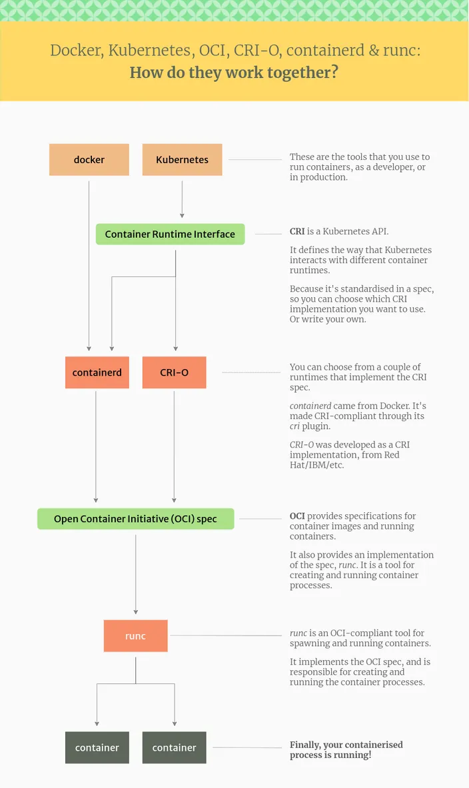

Meta-project for all container-related tools used in the infrastructure (mostly docker replacements)

* runc - low-level container exec
* crun - alternative to runc
* podman - docker cli replacement (front-end for most tools)
* buildah - build OCI images
* skopeo - container repo management
* containerd - runtime for containers
* cri-o - runtime for containers
* kubernetes - container orchestration

